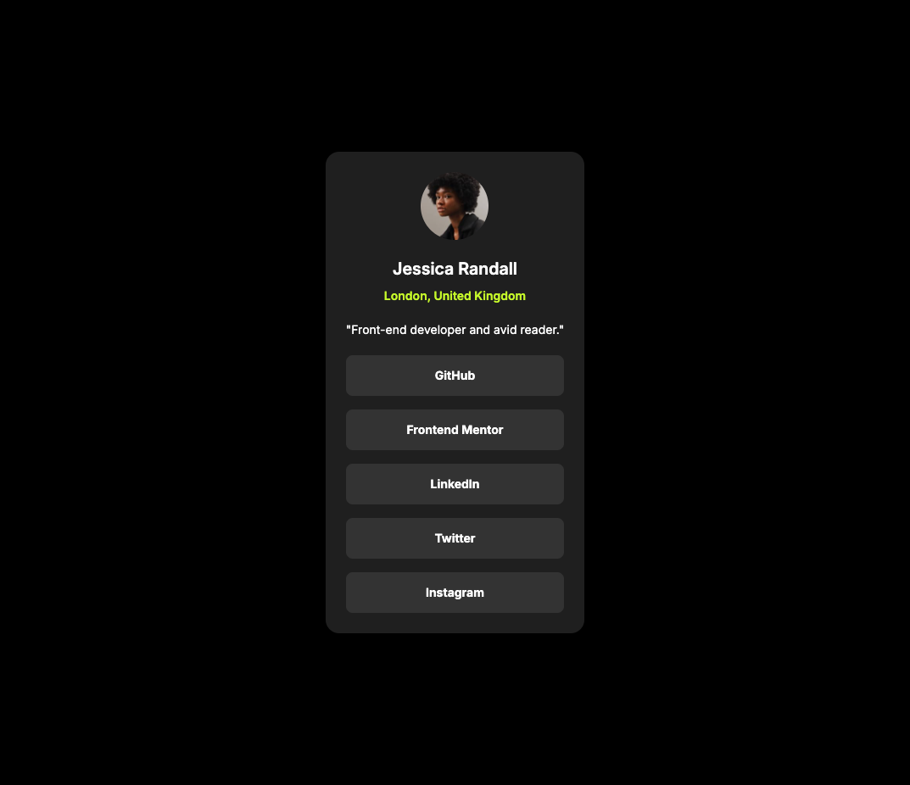

# ⭐️ Frontend Mentor - Social Links Profile

## 📑 Table of Contents

- [Overview](#-overview)
  - [The Challenge](#-the-challenge)
  - [Links](#-links)
- [My Process](#-my-process)
  - [Built With](#-built-with)
  - [What I Learned](#-what-i-learned)
- [Author](#-author)

## 📌 Overview

### The Challenge

The goal was to implement a seamless user experience, with mobile-first responsiveness, integration of real-time features, and a clean, modern design. The profile should allow users to showcase their social media presence and easily navigate through their connected platforms.

### Screenshot

### Links

- **Solution URL**: [GitHub Repository](https://github.com/pedrogl1990/social-links-profile)
- **Live Site URL**: [View Live](https://pedrogl1990.github.io/social-links-profile/)

## 🛠️ My Process

### Built With

- Semantic HTML5 markup
- Mobile-first workflow
- [React](https://reactjs.org/) – JS library
- [Tailwind CSS](https://tailwindcss.com/) – Utility-first CSS framework

### What I Learned

This project helped me reinforce my front-end skills in the following areas:

- Building a mobile-first page following best practices
- Improving my proficiency with React and Tailwind CSS

## 🙋 Author - Pedro Leite

- [Website](https://pedroleite.pt/)
- [Frontend Mentor](https://www.frontendmentor.io/profile/pedrogl1990)
- [LinkedIn](https://www.linkedin.com/in/pedro-guedes-leite/)
